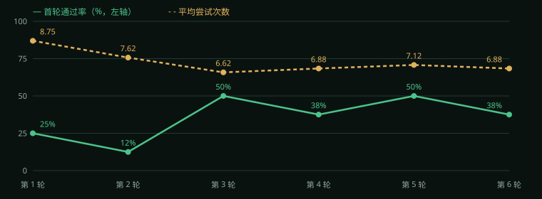

# 基准集跑分

- 生成器：`mock` ｜ 规划器：`mock` ｜ 每轮 8 个固定目标 ｜ 共 5 轮
- 每轮**换新项目**（清画面缓存）、**共享大脑**（经验累加）——曲线涨了才是真学到东西
- 首轮通过率 = 一次都不用修正就过；平均尝试 = 闭环为每个目标花的平均尝试数

| 轮次 | 最终通过率 | 首轮通过率 | 平均尝试次数 | 成本 | 耗时(s) |
| :--: | :--: | :--: | :--: | :--: | :--: |
| 第 1 轮 | 62% | 12% | 8.38 | 121.00 | 78.8 |
| 第 2 轮 | 75% | 25% | 7.25 | 94.00 | 62.5 |
| 第 3 轮 | 88% | 12% | 7.25 | 94.00 | 59.4 |
| 第 4 轮 | 100% | 38% | 6.75 | 82.00 | 55.2 |
| 第 5 轮 | 100% | 12% | 7.25 | 94.00 | 51.7 |

## 结论（照实写，一项一项看）

- 最终通过率：62% → 100%（+38 pp）
- 平均尝试次数：8.38 → 7.25（-1.13）
- 成本：121 → 94（-27）
- 耗时：78.8s → 51.7s（-27.1s）
- **首轮通过率**：12% → 12%（+0 pp）

- 返工量/成本在降 → 大脑的经验进了规划（起手参数带着上次的教训），同类失败被少踩了一遍。
- 但**首轮通过率没涨**：经验只覆盖了一部分缺陷类型，其余仍从默认起手。看「修正过」那列反复出现的键，那就是还没进起手参数的短板。
- 曲线**不保证单调**：生成器本身带随机性，单轮波动不代表退步，看多轮走向。

## 每轮目标明细

**第 1 轮**

| 目标 | 通过 | 首轮通过 | 尝试 | 修正过 | 耗时(s) |
| :--- | :--: | :--: | :--: | :--- | :--: |
| 一只柯基在雪地里奔跑，5 秒短片 | ✅ | ✅ | 6 | — | 4.04 |
| 小猫在窗台上看雨，5 秒 | ✅ | — | 7 | rewrite_prompt_closer | 6.41 |
| 城市夜景车流延时，8 秒 | ❌ | — | 12 | rewrite_prompt_closer | 18.99 |
| 海边日落，一只海鸥飞过，5 秒 | ❌ | — | 12 | increase_reference_strength | 17.45 |
| 森林里的萤火虫，6 秒 | ❌ | — | 7 | — | 6.21 |
| 雪山航拍，10 秒 | ✅ | — | 7 | rewrite_prompt_closer | 6.05 |
| 花朵绽放特写，5 秒 | ✅ | — | 9 | increase_reference_strength、rewrite_prompt_closer | 9.61 |
| 街头滑板少年，8 秒 | ✅ | — | 7 | increase_reference_strength | 10.04 |

**第 2 轮**

| 目标 | 通过 | 首轮通过 | 尝试 | 修正过 | 耗时(s) |
| :--- | :--: | :--: | :--: | :--- | :--: |
| 一只柯基在雪地里奔跑，5 秒短片 | ❌ | — | 10 | — | 17.56 |
| 小猫在窗台上看雨，5 秒 | ✅ | — | 7 | increase_reference_strength | 7.56 |
| 城市夜景车流延时，8 秒 | ✅ | ✅ | 6 | — | 5.67 |
| 海边日落，一只海鸥飞过，5 秒 | ✅ | — | 7 | increase_reference_strength | 7.19 |
| 森林里的萤火虫，6 秒 | ✅ | — | 8 | increase_reference_strength、rewrite_prompt_closer | 8.52 |
| 雪山航拍，10 秒 | ✅ | — | 7 | increase_reference_strength | 5.73 |
| 花朵绽放特写，5 秒 | ✅ | ✅ | 6 | — | 4.52 |
| 街头滑板少年，8 秒 | ❌ | — | 7 | — | 5.71 |

**第 3 轮**

| 目标 | 通过 | 首轮通过 | 尝试 | 修正过 | 耗时(s) |
| :--- | :--: | :--: | :--: | :--- | :--: |
| 一只柯基在雪地里奔跑，5 秒短片 | ✅ | — | 7 | increase_reference_strength | 8.45 |
| 小猫在窗台上看雨，5 秒 | ❌ | — | 7 | — | 7.19 |
| 城市夜景车流延时，8 秒 | ✅ | — | 7 | increase_reference_strength | 9.83 |
| 海边日落，一只海鸥飞过，5 秒 | ✅ | — | 7 | rewrite_prompt_closer | 5.17 |
| 森林里的萤火虫，6 秒 | ✅ | — | 9 | increase_reference_strength、rewrite_prompt_closer | 6.7 |
| 雪山航拍，10 秒 | ✅ | — | 7 | increase_reference_strength | 7.65 |
| 花朵绽放特写，5 秒 | ✅ | ✅ | 6 | — | 4.72 |
| 街头滑板少年，8 秒 | ✅ | — | 8 | increase_reference_strength | 9.72 |

**第 4 轮**

| 目标 | 通过 | 首轮通过 | 尝试 | 修正过 | 耗时(s) |
| :--- | :--: | :--: | :--: | :--- | :--: |
| 一只柯基在雪地里奔跑，5 秒短片 | ✅ | — | 7 | increase_reference_strength | 7.18 |
| 小猫在窗台上看雨，5 秒 | ✅ | ✅ | 6 | — | 4.19 |
| 城市夜景车流延时，8 秒 | ✅ | — | 7 | increase_reference_strength | 7.16 |
| 海边日落，一只海鸥飞过，5 秒 | ✅ | ✅ | 6 | — | 4.49 |
| 森林里的萤火虫，6 秒 | ✅ | ✅ | 6 | — | 3.18 |
| 雪山航拍，10 秒 | ✅ | — | 7 | increase_reference_strength | 10.73 |
| 花朵绽放特写，5 秒 | ✅ | — | 8 | increase_reference_strength、rewrite_prompt_closer | 9.59 |
| 街头滑板少年，8 秒 | ✅ | — | 7 | rewrite_prompt_closer | 8.68 |

**第 5 轮**

| 目标 | 通过 | 首轮通过 | 尝试 | 修正过 | 耗时(s) |
| :--- | :--: | :--: | :--: | :--- | :--: |
| 一只柯基在雪地里奔跑，5 秒短片 | ✅ | — | 8 | rewrite_prompt_closer | 4.55 |
| 小猫在窗台上看雨，5 秒 | ✅ | — | 8 | increase_reference_strength、rewrite_prompt_closer | 5.32 |
| 城市夜景车流延时，8 秒 | ✅ | — | 7 | rewrite_prompt_closer | 6.09 |
| 海边日落，一只海鸥飞过，5 秒 | ✅ | — | 7 | increase_reference_strength | 7.0 |
| 森林里的萤火虫，6 秒 | ✅ | — | 7 | increase_reference_strength | 5.44 |
| 雪山航拍，10 秒 | ✅ | — | 8 | increase_reference_strength | 12.38 |
| 花朵绽放特写，5 秒 | ✅ | — | 7 | rewrite_prompt_closer | 6.2 |
| 街头滑板少年，8 秒 | ✅ | ✅ | 6 | — | 4.68 |

