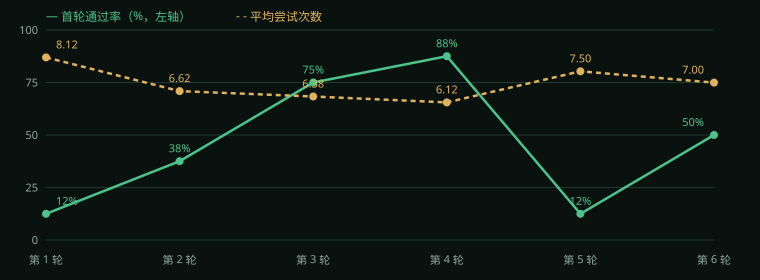

# 基准集跑分

- 生成器：`mock` ｜ 规划器：`mock` ｜ 每轮 8 个固定目标 ｜ 共 6 轮
- 每轮**换新项目**（清画面缓存）、**共享大脑**（经验累加）——曲线涨了才是真学到东西
- 首轮通过率 = 一次都不用修正就过；平均尝试 = 闭环为每个目标花的平均尝试数

| 轮次 | 最终通过率 | 首轮通过率 | 平均尝试次数 | 成本 | 耗时(s) |
| :--: | :--: | :--: | :--: | :--: | :--: |
| 第 1 轮 | 100% | 12% | 8.12 | 115.00 | 59.3 |
| 第 2 轮 | 100% | 38% | 6.62 | 79.00 | 38.8 |
| 第 3 轮 | 100% | 75% | 6.38 | 73.00 | 29.3 |
| 第 4 轮 | 100% | 88% | 6.12 | 67.00 | 29.0 |
| 第 5 轮 | 100% | 12% | 7.50 | 100.00 | 52.5 |
| 第 6 轮 | 100% | 50% | 7.00 | 88.00 | 47.5 |

## 结论（照实写，一项一项看）

- 最终通过率：100% → 100%（+0 pp）
- 平均尝试次数：8.12 → 7.00（-1.12）
- 成本：115 → 88（-27）
- 耗时：59.3s → 47.5s（-11.8s）
- **首轮通过率**：12% → 50%（+38 pp）

- 返工量/成本在降 → 大脑的经验进了规划（起手参数带着上次的教训），同类失败被少踩了一遍。
- 曲线**不保证单调**：生成器本身带随机性，单轮波动不代表退步，看多轮走向。
- 首轮失败最多的三类：semantic_mismatch ×9、character_inconsistency ×8、character_mismatch ×7。
- 天花板说明：mock 世界里 `semantic_mismatch` 是**固定概率**（每镜头 8%，与任何参数无关）→ 首轮通过率不可能到 100%；`character_inconsistency`/`scene_inconsistency` 与参考强度挂钩，所以靠「经验起手」能压下去——两类要分开看，别拿同一个目标衡量。

## 每轮首轮失败的原因分布（哪些参数能改、哪些改不掉）

- 第 1 轮：character_inconsistency ×3、character_mismatch ×3、emotion_wrong ×2、plot_break ×2、scene_inconsistency ×2、low_clarity ×1、low_volume ×1、semantic_mismatch ×1
- 第 2 轮：plot_break ×2、scene_inconsistency ×2、semantic_mismatch ×2、emotion_wrong ×1、motion_blur ×1
- 第 3 轮：character_inconsistency ×1、character_mismatch ×1、motion_blur ×1、semantic_mismatch ×1
- 第 4 轮：semantic_mismatch ×1
- 第 5 轮：character_inconsistency ×3、character_mismatch ×3、emotion_wrong ×2、motion_blur ×2、semantic_mismatch ×2、plot_break ×1、scene_inconsistency ×1
- 第 6 轮：emotion_wrong ×2、motion_blur ×2、semantic_mismatch ×2、character_inconsistency ×1、scene_inconsistency ×1

## 每轮目标明细

**第 1 轮**

| 目标 | 通过 | 首轮通过 | 尝试 | 修正过 | 耗时(s) |
| :--- | :--: | :--: | :--: | :--- | :--: |
| 一只柯基在雪地里奔跑，5 秒短片 | ✅ | — | 12 | increase_reference_strength、rewrite_prompt_action、rewrite_prompt_closer、rewrite_prompt_emotion | 13.73 |
| 小猫在窗台上看雨，5 秒 | ✅ | — | 7 | increase_reference_strength | 5.54 |
| 城市夜景车流延时，8 秒 | ✅ | ✅ | 6 | — | 2.62 |
| 海边日落，一只海鸥飞过，5 秒 | ✅ | — | 9 | increase_reference_strength | 8.41 |
| 森林里的萤火虫，6 秒 | ✅ | — | 9 | increase_reference_strength、rewrite_prompt_emotion | 11.59 |
| 雪山航拍，10 秒 | ✅ | — | 8 | increase_reference_strength、rewrite_prompt_emotion | 8.5 |
| 花朵绽放特写，5 秒 | ✅ | — | 7 | increase_reference_strength | 5.67 |
| 街头滑板少年，8 秒 | ✅ | — | 7 | rewrite_prompt_closer | 3.21 |

**第 2 轮**

| 目标 | 通过 | 首轮通过 | 尝试 | 修正过 | 耗时(s) |
| :--- | :--: | :--: | :--: | :--- | :--: |
| 一只柯基在雪地里奔跑，5 秒短片 | ✅ | — | 7 | rewrite_prompt_closer | 3.29 |
| 小猫在窗台上看雨，5 秒 | ✅ | — | 7 | increase_reference_strength | 6.17 |
| 城市夜景车流延时，8 秒 | ✅ | — | 7 | increase_reference_strength | 5.73 |
| 海边日落，一只海鸥飞过，5 秒 | ✅ | ✅ | 6 | — | 6.68 |
| 森林里的萤火虫，6 秒 | ✅ | ✅ | 6 | — | 2.96 |
| 雪山航拍，10 秒 | ✅ | — | 7 | rewrite_prompt_emotion | 5.68 |
| 花朵绽放特写，5 秒 | ✅ | — | 7 | rewrite_prompt_closer | 3.06 |
| 街头滑板少年，8 秒 | ✅ | ✅ | 6 | — | 5.2 |

**第 3 轮**

| 目标 | 通过 | 首轮通过 | 尝试 | 修正过 | 耗时(s) |
| :--- | :--: | :--: | :--: | :--- | :--: |
| 一只柯基在雪地里奔跑，5 秒短片 | ✅ | ✅ | 6 | — | 3.59 |
| 小猫在窗台上看雨，5 秒 | ✅ | — | 7 | reduce_motion_scale | 4.38 |
| 城市夜景车流延时，8 秒 | ✅ | ✅ | 6 | — | 2.72 |
| 海边日落，一只海鸥飞过，5 秒 | ✅ | — | 8 | increase_reference_strength、rewrite_prompt_closer | 5.1 |
| 森林里的萤火虫，6 秒 | ✅ | ✅ | 6 | — | 3.66 |
| 雪山航拍，10 秒 | ✅ | ✅ | 6 | — | 3.29 |
| 花朵绽放特写，5 秒 | ✅ | ✅ | 6 | — | 3.66 |
| 街头滑板少年，8 秒 | ✅ | ✅ | 6 | — | 2.86 |

**第 4 轮**

| 目标 | 通过 | 首轮通过 | 尝试 | 修正过 | 耗时(s) |
| :--- | :--: | :--: | :--: | :--- | :--: |
| 一只柯基在雪地里奔跑，5 秒短片 | ✅ | ✅ | 6 | — | 4.0 |
| 小猫在窗台上看雨，5 秒 | ✅ | ✅ | 6 | — | 3.21 |
| 城市夜景车流延时，8 秒 | ✅ | — | 7 | rewrite_prompt_closer | 3.53 |
| 海边日落，一只海鸥飞过，5 秒 | ✅ | ✅ | 6 | — | 3.66 |
| 森林里的萤火虫，6 秒 | ✅ | ✅ | 6 | — | 3.25 |
| 雪山航拍，10 秒 | ✅ | ✅ | 6 | — | 3.37 |
| 花朵绽放特写，5 秒 | ✅ | ✅ | 6 | — | 4.14 |
| 街头滑板少年，8 秒 | ✅ | ✅ | 6 | — | 3.88 |

**第 5 轮**

| 目标 | 通过 | 首轮通过 | 尝试 | 修正过 | 耗时(s) |
| :--- | :--: | :--: | :--: | :--- | :--: |
| 一只柯基在雪地里奔跑，5 秒短片 | ✅ | — | 8 | increase_reference_strength、rewrite_prompt_emotion | 5.1 |
| 小猫在窗台上看雨，5 秒 | ✅ | — | 7 | increase_reference_strength | 5.44 |
| 城市夜景车流延时，8 秒 | ✅ | — | 7 | rewrite_prompt_closer | 2.93 |
| 海边日落，一只海鸥飞过，5 秒 | ✅ | — | 7 | rewrite_prompt_emotion | 6.33 |
| 森林里的萤火虫，6 秒 | ✅ | ✅ | 6 | — | 4.29 |
| 雪山航拍，10 秒 | ✅ | — | 9 | increase_reference_strength、rewrite_prompt_closer、rewrite_prompt_emotion | 7.34 |
| 花朵绽放特写，5 秒 | ✅ | — | 8 | increase_reference_strength | 11.2 |
| 街头滑板少年，8 秒 | ✅ | — | 8 | increase_reference_strength | 9.85 |

**第 6 轮**

| 目标 | 通过 | 首轮通过 | 尝试 | 修正过 | 耗时(s) |
| :--- | :--: | :--: | :--: | :--- | :--: |
| 一只柯基在雪地里奔跑，5 秒短片 | ✅ | ✅ | 6 | — | 2.91 |
| 小猫在窗台上看雨，5 秒 | ✅ | — | 8 | increase_reference_strength、rewrite_prompt_closer | 8.25 |
| 城市夜景车流延时，8 秒 | ✅ | — | 7 | rewrite_prompt_closer | 5.33 |
| 海边日落，一只海鸥飞过，5 秒 | ✅ | ✅ | 6 | — | 3.52 |
| 森林里的萤火虫，6 秒 | ✅ | — | 10 | increase_reference_strength | 14.26 |
| 雪山航拍，10 秒 | ✅ | ✅ | 6 | — | 4.07 |
| 花朵绽放特写，5 秒 | ✅ | — | 7 | rewrite_prompt_emotion | 5.05 |
| 街头滑板少年，8 秒 | ✅ | ✅ | 6 | — | 4.13 |

